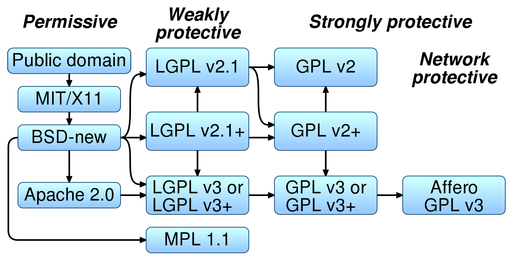

# 源代码式引用风险治理规则
## 社区对于源代码（包括文件和片段，以下统称源代码）引用风险的总体策略
1. 不鼓励但允许源代码代码引用（推荐迁移成包管理器引用）
2. 严格禁止“引用其他开源项目的源代码，并变更其原始License和Copyright声明”的情况。。该种情况将为社区和开发者个人带来严重的声誉和合规风险。
3. 严格禁止“被引入的源代码的License和项目的License不兼容”的情况。如：在MulanPSL-2.0（宽松License)的项目中，引入了GPL-2.0-only的片段。这个会给社区的下游带来严重的合规风险。
## 风险一：变更了源代码原始的License/Copyright(以下可能会使用简写L/C)声明的风险治理规则
### 风险分析： **关键点**- 不要有意或无意的变更了被引用的源代码的License&Copyright声明  
1. 我们需要关注4个要素：被引用的源代码所在的开源项目（Referenced Project, 有时也会被称为远程项目）的License/Copyright, 被引用的源文件（Referenced File, 包含文件和片段, 有时也会称为远程文件)的License/Copyright，被引入源文件引入的本地项目（以下简称本地项目）License/Copyright，承载被引入源文件的本地项目的文件（以下简称本地文件）License/Copyright。
2. 如果某一段源代码片段的的License或Copyright未声明，则它会继承该片段所在文件的License/Copyright声明，如果一个源代码文件的License/Copyright未声明，那么他会继承文件所在项目的License/Copyright声明。
### 治理规则：
我们考虑每个源文件只存在一个License/Copyright的声明的情况 (以下使用简写 RPL: Referenced Project License, RPC: Referenced Project Copyright, LFL: Local File License, LFC: Local File Copyright)：
我们定义每个文件”实际“的License/Copyright(ERFL: Effective Referenced File License， ERFC: Effective Referenced File Copyright, ELFL, ELFC同理),即按照继承规则，当文件L/C声明为空的时候，继承项目的L/C声明。
|情景编号|被引用文件的L/C声明|本地文件的L/C声明|被引用文件的"实际"L/C声明(ERFL/ERFC)|本地文件的实际L/C声明(ELFL/ELFC)|关注的风险 eRFL != ELFL or ERFC != ERFC|整改措施|
| ---- |      ----      |     ----      |        ----          |     -----       | ---     | ---     |
| 1 |        空      |     空         |   RPL/RPC           |    LPL/LPC      | RPC一定不等于LPC, LPL 大概率不等于 RPL; 该类情况一定要重点关注| 本地文件添加RPL, RPC声明，并增加出处声明|
| 2 |        空      |     有         |   RPL/PRC           |    LFL/LFC      | 除非是已按情况1进行整改，否则会存在RPC != LFL, RPL != LFC的风险| 本地文件修改为RPL, RPC声明，并增加出处声明|
| 3 |        有      |     空         |   RPL/PRC           |    LFL/LFC      | RPC一定不等于LPC, LPL 大概率不等于 RPL;该类情况一定要重点关注 | 本地文件修改为RFL, RFC声明，并增加出处声明|
| 4 |        有      |     有         |   RFL/PFC           |    LFL/LFC      | 检查是否 RFC <> RFL <> LFL | 本地文件修改为RFL, RFC声明，并增加出处声明|


片段的情况同理。   
增加出处声明的示例如下：
```
/* Copyright [copyrighter] [year]
 *
 * Licensed under the Apache License, Version 2.0 (the "License");
 * you may not use this file except in compliance with the License.
 * You may obtain a copy of the License at
 *
 *     http://www.apache.org/licenses/LICENSE-2.0
 *
 * Unless required by applicable law or agreed to in writing, software
 * distributed under the License is distributed on an "AS IS" BASIS,
 * WITHOUT WARRANTIES OR CONDITIONS OF ANY KIND, either express or implied.
 * See the License for the specific language governing permissions and
 * limitations under the License.
 */

 /* This file was copied from project [developer name][project name] /*
 ```
即前半段使用请使用ERFL/ERFC，后半段增加该文件的出处声明，尽可能同时包含开发开发者/开发组织的名字和项目的名字。后半段的出处声明为最佳实践，不做强制要求。

## 风险二：源代码级的License冲突风险治理规则
### 风险分析：
1. **源代码级的License冲突是最应该关注的License冲突**，因为是在同一个项目中存在有License冲突的2个源文件，绑定是最紧密的，无论是发布源代码还是二进制，它们都将一起分发。
2. **源代码片段引用容易引入源码级的License冲突**。举例：在MulanPSL-2.0的项目中引入了GPL-2.0-only的代码片段。
3. 实践中，我们一般不考虑文件和文件的License的冲突，**只考虑项目和其中文件的License冲突**，如果项目和其中每个文件的License兼容，则项目中的两两文件也不存在冲突。即只需要检查本地项目的License声明(LPL)与被引用文件的“实际的”License是否存在冲突。
### 治理规则：

如果被引用文件的“实际的"License能通过一条路径到达本地项目的License（有方向),则说明License兼容，否则冲突。


